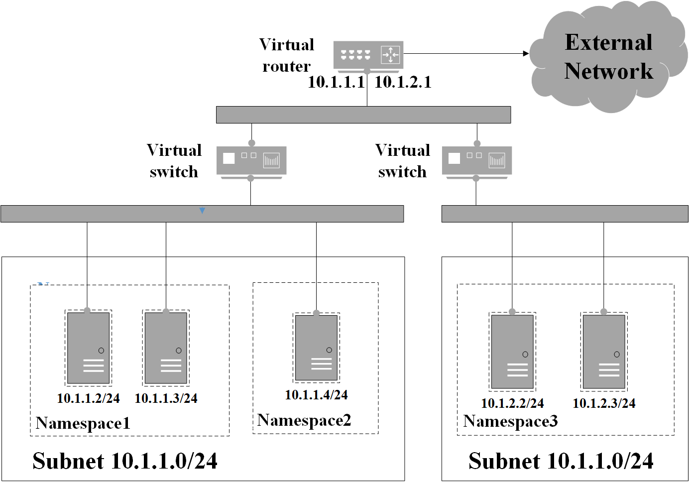
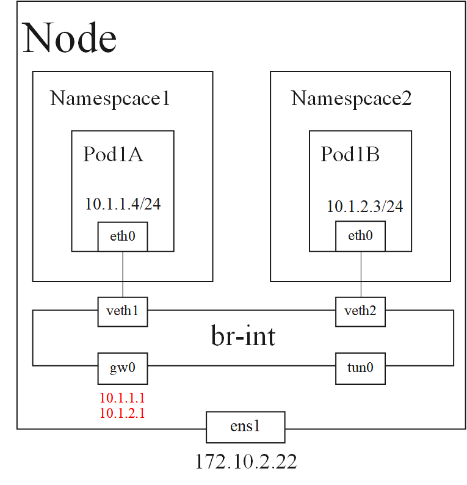
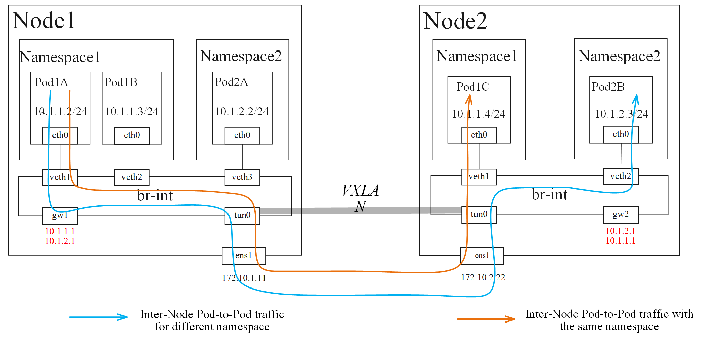

# kubefay
### Kubernets环境下的基于OVS的半虚拟网络解决方案。
<br/>

[](https://github.com/RichardLitt/standard-readme)
[](https://github.com/kubefay/kubefay/actions/workflows/main.yml)
[](https://github.com/kubefay/kubefay)
[](https://github.com/kubefay/kubefay)
[](https://github.com/kubefay/kubefay)


## 目录

- [简介](#简介)
- [安装](#安装)
- [使用](#使用)
- [参与项目](#参与项目)
- [展望](#展望)
- [开源许可](#开源许可)

## 简介
kubefay是[kubernetes/k8s](https://kubernetes.io/docs/home/)下的网络解决方案。[CNI](https://github.com/containernetworking/cni)是容器编排系统(包括k8s)使用的统一容器网络配置接口。kubefay基于[Open vSwitch/OVS](https://www.openvswitch.org/)为k8s提供半虚拟化网络。

### kubefay功能
- 以命名空间隔离的子网方案
- 内置IP地址管理插件
- 静态IP支持
- 虚拟化网络拓扑


### 与其他CNI相比
基于OVS的常用CNI网络插件包括Kube-OVN和Antrea.

Kube-OVN是灵雀云开源的网络插件。该插件具有命名空间隔离的子网管理机制，功能强大。由于引入了完整的SDN控制器OVN，Kube-OVN的性能相对较弱，网络流表复杂，网络运维困难。

Antrea由VMware研发并开源，性能较好，但功能相对单一。采用OVS自建流表的方式构建，网络诊断相对便捷。

kubefay力求在两者之间寻找平衡点，既有Antrea的性能，也具备Kube-OVN的部分功能。kubefay基于Antrea的OVS及openflow库开发，构建适合云原生场景的半虚拟化网络，提供较为灵活的网络拓扑和IP地址管理能力。

### 初步了解kubefay网络
<div align="center">

</div>

如上图所示，kubefay中Subnet可以关联一个或者多个Namespace，同一Subnet下的Namespace中的Pod处于同一局域网落下（二层可达）。不同Subnet通过逻辑路由器转发路由形成k8s的内部网络。k8s的内部网络亦通过逻辑路由与外部网络连接。

## 安装
在[kind](https://kind.sigs.k8s.io/docs/user/quick-start/#installation)中体验kubefay，需首先安装[helm](https://helm.sh/zh/docs/intro/install/)工具。安装完成后执行:
```
git clone https://github.com/kubefay/kubefay.git && cd kubefay
make cluster
helm template kubefay --set kindCluster.enabled=true --dry-run ./build/helm/kubefay/ | kubectl apply -f -
kubectl apply -f ./build/helm/kubefay/defaultnet/subnet.yaml
```
## 使用
### 默认子网络
Kubefay安装后默认配置一个默认子网defautlnet，该子网配置如下：
```
apiVersion: kubefay.kubefay.github.com/v1alpha1
kind: SubNet
metadata:
  name: defaultnet
spec:
  ipVersion: v4
  cidr: 10.192.0.0/16
```
默认子网为IPv4协议，IP地址范围是10.192.0.0/16。Kubefay默认将子网中的第一个地址，即10.192.0.1作为子网默认网关。默认子网参数可于build/helm/kubefay/defaultnet/subnet.yaml配置。

### 新建子网络
除默认子网外，用户可新建设自定义子网络。

1 新建子网资源。举个栗子，下边的配置可生成名为newnet的子网，子网IP地址池为10.182.0.0/16。
```
apiVersion: kubefay.kubefay.github.com/v1alpha1
kind: SubNet
metadata:
  name: newnet
spec:
  ipVersion: v4
  cidr: 10.182.0.0/16
```
2 子网生成后，还需新建Namespace并关联至子网。以下配置创建了kubefay-test Namespace，并将其关联至newnet子网。此后，kubefay-test下所有Pod从属于newnet子网。
```
apiVersion: v1
kind: Namespace
metadata:
  name: kubefay-test
  annotations:
    subnet: newnet
```

### 查看子网使用情况

通过执行如下命令查看子网详细信息
```
kubectl describe subnet defaultnet
```

UsedPool字段展示了defaultnet子网内已经被分配的IP情况，并提供该IP对应的Node名称、Namespace、Pod名称、容器ID、网卡名称。

PoolStatus字段展示了当前IP地址池的使用情况。

### 设置Pod静态IP
kubefay支持对单个Pod设置静态IP。在Pod的metadata.annotations字段下，添加键为IPv4，值为对应IP地址的注解即可为Pod配置静态IP。例如：
```
apiVersion: v1
kind: Pod
metadata:
  name: test-worker-static
  labels:
    app: ipam-app
  annotations:
    IPv4: 10.192.255.253
spec:
  nodeName: kind-worker
  containers:
  - name: nginx
    image: kubefay/kubefay-ubuntu:latest
    imagePullPolicy: Never
    command: [ "kubefay-test-server" ]
    ports:
    - containerPort: 80
```

## kubefay网络原理简介
<!-- ### SDN架构、OVS、Openflow
 -->

### kubefay网络设备
<div align="center">

</div>

如上图，kubefay中每个Node上存在一个OVS虚拟交换机br-int，Pod通过veth pair设备连接至br-int。gw0接口是所有子网公用的网关接口，配置所有子网的网关IP地址。tun0接口用于封装不同Node间Pod通信的Overlay网络流量。
### kubefay节点内流量
<div align="center">

</div>

如图，同一节点内网络流量有三类：
- 同一子网下Pod间流量，如Pod1A与Pod1B间流量。此类流量将通过br-int交换机直接二层转发。
- 不同子网下Pod间流量，如Pod1A与Pod2A间流量。此类流量将首先转发至gw网关接口进入Node1。之后Node1主机将流量路由转发回br-int交换机转发至对应端口。
- Pod和外部网络间流量，如Pod1A访问互联网的流量。此类流量将转发至gw网关到Node1节点，由Node1节点NAT至外部网络。

### kubefay节点间流量
<div align="center">
<!-- 
 -->


</div>
不同节点间的Pod流量有两种：
- 同一子网下不同Node下的Pod流量，如Pod1A与Pod1C间流量。该类流量由br-int转发至tun口，封装为Overlay流量后转发至对端tun0口。流量解封装后转发至对应端口。
- 不同子网下不同Node节点下Pod流量，如Pod1A与Pod1C间流量。该类流量首先由Nod1节点路由，此后再封装、解封装、转发至对端。

## 参与项目

### issue
[提出bug、新功能](https://github.com/kubefay/kubefay/issues/new)

### Pull request
1. fork项目
2. 添加新功能或解决bug
3. 合并commit历史为一个
4. pull最新master分支，rebase
5. 处理冲突并提交pr
6. 通过CI测试
7. code review
8. 并入master分支

## 展望
[展望](https://github.com/kubefay/kubefay/milestones)

## 开源许可
[Apache 2 © kubefay](./LICENSE) 