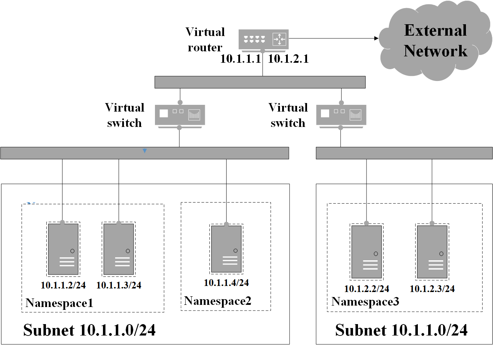
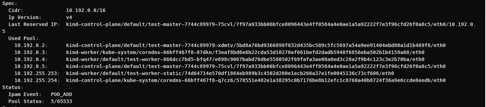
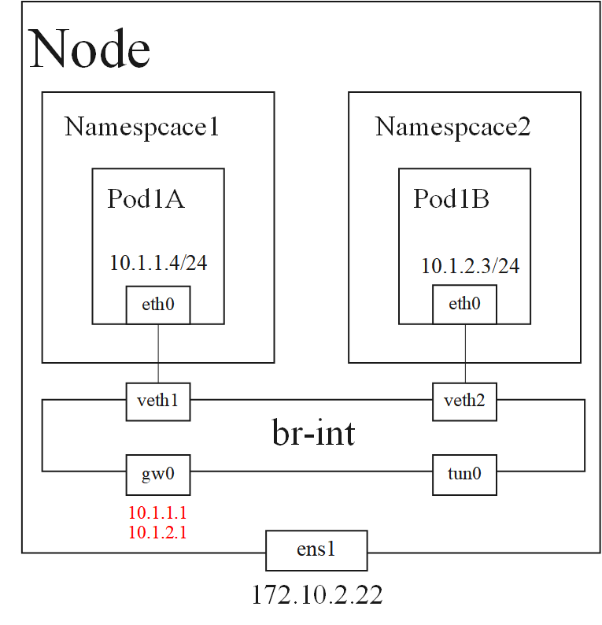
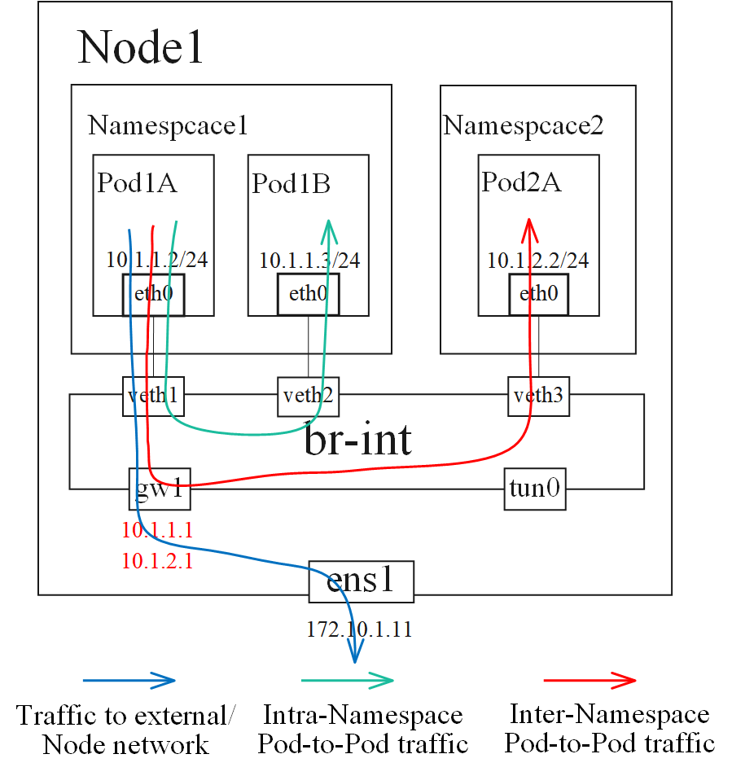
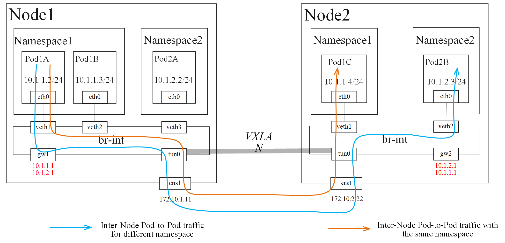

# Kubefay 
### Semi-virtual network solution based on OVS in Kubernets Environment
<br/>

[](https://github.com/RichardLitt/standard-readme)
[](https://github.com/kubefay/kubefay/actions/workflows/main.yml)
[](https://github.com/kubefay/kubefay)
<!-- [](https://github.com/kubefay/kubefay)
[](https://github.com/kubefay/kubefay) -->

## Document Language
[[English](./README.md)]
[[简体中文](./README.ZH.md)]

## Table of Contents

- [Background](#background)
- [Install](#install)
- [Usage](#usage)
- [Contributing](#contributing)
- [RoadMap](#roadmap)
- [License](#license)

## Background
Kubefay is a network solution under [kubernetes/k8s](https://kubernetes.io/docs/home/). [CNI](https://github.com/containernetworking/cni) is a unified container network configuration interface used by container orchestration systems(including K8s). Kubefay is based on [Open vSwitch/OVS](https://www.openvswitch.org/),provides a paravirtualized network for k8s.

### Naming of kubefay
The name Kubefay comes from [Chang'e](https://en.wikipedia.org/wiki/Chang%27e), an ancient Chinese mythological figure. Chang'e longed for a beautiful paradise, and finally became a fairy in the Moon Palace through hard work. Network virtualization is also a fascinating field, which is the destination for kubefay as paradise for Chang'e.


### Why Kubefay
- Namespace isolated subnet scheme
- Built in IP address management plugin
- Static IP support
- Virtualized network topology

### Compare with other CNI
CNI network plugins based on OVS used widly include Kube-OVN and Antrea.

Kube-OVN is an open source network plugin from alauda cloud. This plugin has the namespace isolation subnet management mechanism, the function is powerful. Due to the introduction of a complete SDN controller OVN, kube-OVN has relatively weak performance, complex network flow table, and difficult network operation. 

Antrea was developed by VMware, which is open source. It has good performance but relatively single function. The network diagnosis is convenient by using the method of OVS self-built flow table. 

Kubefay tries to strike a balance between the performance of Antrea and some of the functionality of Kube-OVN. Based on Antrea's OVS and openflow library development, kubefay builds a semi-virtual network suitable for cloud native scenarios, providing more flexible network topology and IP address management capabilities.

### Understanding kubefay network
<div align="center">

</div>

As shown in the figure above, a Subnet in Kubefay can associate one or more Namespaces, and Pods in a Namespace under the same Subnet falls under the same Lan (two layer network reachable). Different subnets are routed through a logical router. The network of K8s is also connected to the external network through logical routing.

## Install
To experience kubefay in [kind](https://kind.sigs.k8s.io/docs/user/quick-start/#installation), you need to install [helm](https://helm.sh/zh/docs/intro/install/) first. After the installation, the follow commands should be executed:
```
git clone https://github.com/kubefay/kubefay.git && cd kubefay
make cluster
helm template kubefay --set kindCluster.enabled=true --dry-run ./build/helm/kubefay/ | kubectl apply -f -
kubectl apply -f ./build/helm/kubefay/defaultnet/subnet.yaml
```

## Usage
### Default Subnet
After Kubefay is installed, a default subnet defautlnet is configured by default, which is configured as follows:
```
apiVersion: kubefay.kubefay.github.com/v1alpha1
kind: SubNet
metadata:
  name: defaultnet
spec:
  ipVersion: v4
  cidr: 10.192.0.0/16
```
The default subnet is IPv4 protocol, and the IP address range is 10.192.0.0/16. Kubefay takes the first address in the subnet, namely 10.192.0.1, as the default gateway of the subnet by default. The default subnet parameters can be configured in build/helm/kubefay/defaultnet/subnet.yaml.

### Create new Subnet
In addition to the default subnet, users can create a new custom subnet as follows.

1 Create a new subnet resource. For example, the lower configuration generates a subnet named newnet, whose IP address pool is 10.182.0.0/16.
```
apiVersion: kubefay.kubefay.github.com/v1alpha1
kind: SubNet
metadata:
  name: newnet
spec:
  ipVersion: v4
  cidr: 10.182.0.0/16
```
2 After the Subnet is generated, a new Namespace need to be associated to the subnet. The following configuration creates kubefay-test Namespace and associit to the newnet Subnet. Thereafter, all Pods subordinate to the newnet subnet are under kubefay-test.
```
apiVersion: v1
kind: Namespace
metadata:
  name: kubefay-test
  annotations:
    subnet: newnet
```

### Describe Subnet
View subnet details by executing the following command
```
kubectl describe subnet defaultnet
```


UsedPool field shows the IP that has been assigned within the defaultnet subnet and provides the corresponding Node name, Namespace, Pod name, container ID, and network interface name for the IP. The PoolStatus field shows the current IP address pool usage.

### Set static IP fot Pod
Setting a static IP on a single Pod is supported. Add key IPv4 and the value corresponding to the IP address under the metadata.annotations field of Pod to configure static IP. For example:
```
apiVersion: v1
kind: Pod
metadata:
  name: test-worker-static
  labels:
    app: ipam-app
  annotations:
    IPv4: 10.192.255.253
spec:
  nodeName: kind-worker
  containers:
  - name: nginx
    image: kubefay/kubefay-ubuntu:latest
    imagePullPolicy: Never
    command: [ "kubefay-test-server" ]
    ports:
    - containerPort: 80
```

## Introduction to kubefay network principle

### Network devices of kubefay
<div align="center">

</div>

As shown above, there is an OVS virtual switch br-int on each Node in Kubefay, and the Pods connect to br-int via the veth pair device. The gw0 interface is the gateway interface common to all subnets with gateway Ip addresses for all subnets. The tun0 interface is used to encapsulate Overlay network traffic for Pod communication between different nodes.

### Network flow intra Node
<div align="center">

</div>

As you can see, there are three types of network traffic within the same node:
- inter-Pod traffic within the same subnet, such as Pod1A and Pod1B traffic. This type of traffic will be forwarded directly through the br-int Switch at Layer 2 network. 
- inter-Pod traffic on different subnets, such as between Pod1A and Pod2A. Such traffic will first be forwarded to the gw gateway interface into Node. The host then forwards the traffic route back to the br-int switch and forwards it to the corresponding port. 
- Pod to external network traffic, such as Pod1A traffic to the Internet. Traffic is forwarded to the gw gateway to the host. Then Node1 NAT the flow to external network.

### Network flow inter Node
<div align="center">
<!-- 
 -->

</div>

There are two types of pod traffic between different nodes:
- Pod traffic under different Nodes in the same subnet, such as the traffic between Pod1A and Pod1C. This kind of traffic is forwarded to the tun port by br-int, encapsulated as overlay traffic, and then forwarded to the opposite end tun0 port.The traffic is unpacked and forwarded to the corresponding port.
- Pod traffic under different nodes in different subnets, like the traffic between Pod1A and Pod1C. This kind of traffic is first routed by Nod1, and then encapsulated, unpacked and forwarded to the opposite end.

## Contributing

### Issue
[New issuse](https://github.com/kubefay/kubefay/issues/new)

### Pull request
1. fork the project
2. add new features or fix bugs
3. rebase your commits into one
4. pull and reabase by the master branch
5. deal conflicts and pull request
6. pass the CI tests
7. code review
8. merged into master

## RoadMap
[Road Map](https://github.com/kubefay/kubefay/milestones)

## License
[Apache 2 © kubefay](./LICENSE) 